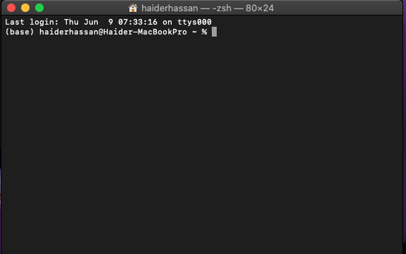

## **ChIP-seq and ATAC-seq Processing and Peak calling Software (CAPPS)**
-----------------------------
&nbsp;
&nbsp;
&nbsp;
&nbsp;
&nbsp;

### Table of Contents

1. [Introduction](#introduction)
2. [Genome Alignment](#genome-alignment)
3. [Bioinformatics Packages](#bioinformatics-packages)
4. [Installation of Necessary Bioinformatics Packages](#installation-of-necessary-bioinformatics-packages)


&nbsp;
&nbsp;
&nbsp;
&nbsp;
&nbsp;

### **Introduction**
Python based software for the processing and peak calling of ATAC-seq and ChIP-seq Datasets. The program relies on the following key python modules:
```
tkinter
datetime
pandas
argparse
subprocess
turtle
```
CAPPS will attempts to install the necessary python packages on first launch. At first, it will check for `pip ` installation. If **pip** is installed, then it will attempt installation of the above mentioned programs, if they are not imported. 


&nbsp;

### **Genome Alignment**

CAPPS currently does not offer `fastq` file alignment for SAM file generation or SAM to BAM file conversion. Use the code below for alignment of fastq files, constituting raw sequence data, with mouse or human genome and SAM to BAM conversion:

&nbsp;
&nbsp;

1. Install bowtie2 and samtools
> sudo apt-get install bowtie2
> sudo apt-get install samtools

2. Mouse genome preparation:

&nbsp;

   - Open terminal and make directory
  
  > mkdir genome_dir/
  
   - Download genome. Provided is a code for downloading mouse genome:
  
  > wget https://hgdownload.soe.ucsc.edu/goldenPath/mm39/bigZips/mm39.fa.gz
  
   - Index mouse genome 
  
  > bowtie2-build mm39.fa mm39bowtie

&nbsp;

3. Align the fastq file with the appropriate genome:

> bowtie2 --very-sensitive –dovetail --quiet --maxins 1000  --met-file ./file_metrics.txt -x ./path/to/genome/indexes -1 ./path/to/R1_reads -2 ./path/to/R2/reads  -S output.sam

4. Convert the resulting `.SAM` file to `.BAM` file:

>Samtools view -bS 58_DKO.sam > 58_DKO.bam


&nbsp;
&ensp;
&nbsp;
&ensp;

### **Bioinformatics Packages**

CAPPS automatically integrates shell and Java scripting into the python code, so the user does not have to be familiar either of the programming languages. However, the following packages need to be installed for CAPPS to work:

&nbsp;

1. For BAM file filtering, the following packages are required:
```
Samtools 
Bamtools
picards (Java) 
 
```
**_Picards is written in Java, so ensure you have java, as well as JDK tool set installed on your computer_**

&nbsp;

2. For peak calling and the conversion of `.bedgraph` or `.bdg` file to `bed` file:
```
MACS2
Bedtools
 
```
`bed` files are required for differential peak analysis using **CAAT**, which is a peak analysis tool based in **_Shiny Dashboard_**

&nbsp;

3. For `.bedgraph` or `.bdg` file to `.BigWig` or `.bw`  file conversion:
```
bioawk
bedClip
bedgraphtobigwig
bedtools 

```
The `.BigWig` or `.bw` file is necessary for visualizing normalized peaks in **_IGV_** or **_pygenometracks_** for generating peak summit tracks for publication quality figures. 
   
&nbsp;
&ensp;
&nbsp;
&ensp;

### **Installation of Necessary Bioinformatics Packages**

&nbsp;
&ensp;

The installation of the above mentioned programs require basic knowledge of the command line. For reference, I have included an image of the terminal in a mac




