## **ChIP-seq and ATAC-seq Processing and Peak calling Software (CAPPS)**
-----------------------------
&nbsp;
&nbsp;
&nbsp;
&nbsp;
&nbsp;

### Table of Contents

1. [Introduction](#introduction)
2. [Genome Alignment](#genome-alignment)
3. [Bioinformatics Packages](#bioinformatics-packages)
4. [Installation of Necessary Bioinformatics Packages](#installation-of-necessary-bioinformatics-packages)
5. [Using CAPPS](#using-capps)

&nbsp;
&nbsp;
&nbsp;
&nbsp;
&nbsp;

### **Introduction**
CAPPS is a Python based software for the processing and peak calling of **A**ssay for **T**ransposase **A**ccessible **C**hromatin (ATAC-seq) and **C**hromatin **I**mmunopreci**p**itation **seq**uencing (ChIP-seq) datasets. The program relies on the following key python modules:
```
tkinter
datetime
pandas
argparse
subprocess
turtle
```

CAPPS will attempts to install the necessary python packages on first launch. At first, it will check for `pip ` installation. If **pip** is installed, then it will attempt installation of the above mentioned programs, if they are not imported. 

------------------------------------

&nbsp;

### **Genome Alignment**

CAPPS currently does not offer `fastq` file alignment for SAM file generation or SAM to BAM file conversion. Use the code below for alignment of fastq files, constituting raw sequence data, with mouse or human genome and SAM to BAM conversion:

&nbsp;
&nbsp;

1. Install bowtie2 and samtools
> sudo apt-get install bowtie2
> sudo apt-get install samtools

2. Mouse genome preparation:

&nbsp;

   - Open terminal and make directory
  
  > mkdir genome_dir/
  
   - Download genome. Provided is a code for downloading mouse genome:
  
  > wget https://hgdownload.soe.ucsc.edu/goldenPath/mm39/bigZips/mm39.fa.gz
  
   - Index mouse genome 
  
  > bowtie2-build mm39.fa mm39bowtie

&nbsp;

3. Align the fastq file with the appropriate genome:

> bowtie2 --very-sensitive –dovetail --quiet --maxins 1000  --met-file ./file_metrics.txt -x ./path/to/genome/indexes -1 ./path/to/R1_reads -2 ./path/to/R2/reads  -S output.sam

&nbsp;

4. Convert the resulting `.SAM` file to `.BAM` file:

>Samtools view -bS 58_DKO.sam > 58_DKO.bam

------------------------------------

&nbsp;
&ensp;
&nbsp;
&ensp;

### **Bioinformatics Packages**

CAPPS automatically integrates shell and Java scripting into the python code, so the user does not have to be familiar either of the programming languages. However, the following packages need to be installed for CAPPS to work:

&nbsp;

1. For BAM file filtering, the following packages are required:
```
Samtools 
Bamtools
picards (Java) 
 
```
**_Picards is written in Java, so ensure you have java, as well as JDK tool set installed on your computer_**

&nbsp;

2. For peak calling and the conversion of `.bedgraph` or `.bdg` file to `bed` file:
```
MACS2
Bedtools
 
```

`bed` files are required for differential peak analysis using **CAAT**, which is a peak analysis tool based in **_Shiny Dashboard_**

&nbsp;

3. For `.bedgraph` or `.bdg` file to `.BigWig` or `.bw`  file conversion:
```
bioawk
bedClip
bedgraphtobigwig
bedtools 

```
The `.BigWig` or `.bw` file is necessary for visualizing normalized peaks in **_IGV_** or **_pygenometracks_** for generating peak summit tracks for publication quality figures. 

------------------------------------

&nbsp;
&ensp;
&nbsp;
&ensp;

### **Installation of Necessary Bioinformatics Packages**

The installation of the above mentioned programs require basic knowledge of the command line. The terminal in MAC OSX can be launched by doing a **_spotlight search_** and typing **TERMINAL**. Click on the terminal icon to launch terminal. For reference, I have included an image of the terminal in a mac


&nbsp;

### Install Conda packages 
1. Install Anaconda by following instructions on the [Anaconda website](https://www.anaconda.com/products/distribution).
2. Install samtools, bamtools, bedtools, bedClip and bedgraphtobigwig using conda as follows:

   - samtools:
   
> conda install -c bioconda samtools 

   - bamtools:
   
> conda install -c bioconda bamtools 

   - bedtools:
   
> conda install -c bioconda bedtools 

   - bedClip:
   
> conda install -c bioconda/label/cf201901 ucsc-bedclip 

   - bedgraphtobigwig
  
> conda install -c bioconda/label/cf201901 ucsc-bedgraphtobigwig 

&nbsp;

### Install picards:
1. Install java by following instructions on the [Java website](https://www.java.com/en/).
2. Install JDK tools by following instructions on the [Oracle website](https://www.oracle.com/java/technologies/downloads/)
3. Download the latest release of **_picards.jar_** from the [GitHub page](https://github.com/broadinstitute/picard/releases/tag/2.27.3)
4. Now you can select **_picards.jar_** when prompted in the CAPPS software.  

&nbsp;

### Install bioawk:
1. Bioawk is installed using terminal. Type the following commands in terminal:
   - Download bioawk:
   
> sudo apt-get install libz-dev

> sudo apt-get install bison

> git clone https://github.com/lh3/bioawk

   - This will update the libraries for **libz-dev** and **bison** and download bioawk in your working directory
   - Manouver to the directory containing bioawk using the following commands:
   
> cd ./Path/to/bioawk

2. Use the command **_make_** to install bioawk:

> sudo make

This will install the unix executable **bioawk** file you need to select when prompted in the CAPPS software. The file should look like this in your directory:

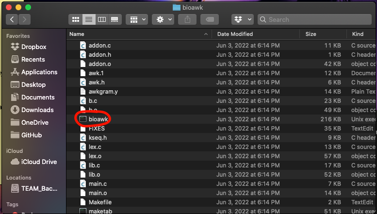

&nbsp;

### Install pip packages:

1. Install pip:

> python3 install pip --upgrade 

2. Install macs2

> pip install macs2

&nbsp;

After the installation of these packages, you are now ready to use CAPPS

------------------------------------
&nbsp;
&ensp;
&nbsp;
&ensp;


### **Using CAPPS**

Once the above packages are installed and you have BAM files ready for filtering, you can launch CAPPS from the docker container or via a python IDE, such as visual studio code. 

&nbsp;

The opening page for CAPPS gives simple directions on output, and requirements for running CAPPS. 

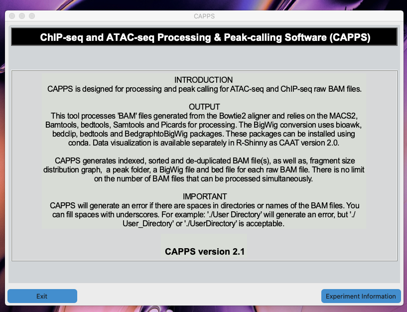

&nbsp;

In order to proceed, click on the **_Experimental Information_** button. This will allow the user to enter experimental information.

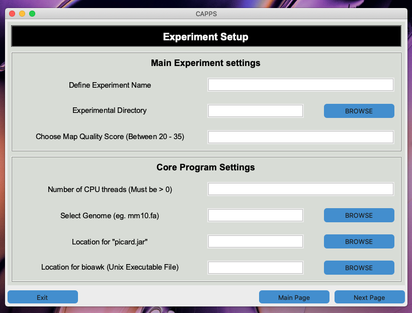

&nbsp;


### **Fill in the following information in order to proceed:**

1. **Define Experiment Name:** Name the experiment. This is the name for the **Experiment Settings** text tile that will be saved in the experimental folder 
2. **Experimental Directory:** Click on the **_Browse_** button to select the directory where the output files will be saved. 
3. **Map Quality Score:** Provide a **Map Quality score** between 20 - 35. This is equivalent to the **_PHRED score_**, which is a measure of the quality of the sequencing of the nucleotides generated by the high throughput DNA sequencing. A higher **Map Quality score** increases the stringency of BAM file filtering. 
      - **NOTE**: CAPPS will not proceed unless the map quality score is between 20 - 35. 
4. **Number of CPU threads:** This is the computing power that is being dedicated for `.bam` file filtering and peak calling. 
      - **NOTE**: CAPPS will automatically detect the number of CPU threads in your computer. If the number you select is greater then the total number of CPU threads in your computer, CAPPS will generate an error. 
5. **Select Genome**: Select the genome for your organism. The sequence file must end in `.fa` or `.fna`. 
      - **NOTE**: CAPPS will not allow the user to select a file that does not end in the `.fa` or `.fna` extensions. 
6. **Location for "picard.jar":** Select the directory where you downloaded picards.jar.
      - **NOTE**: Its necessary to select the directory where **picard.jar** is located. The program will not let you proceed if **picard.jar** is not selected. 
7. **Location for "Bioawk":** Select the directory where bioawk was installed. 

Once the experimental variables have been selected, click on the **_Next Page_** button to proceed. 

&nbsp;
&nbsp;

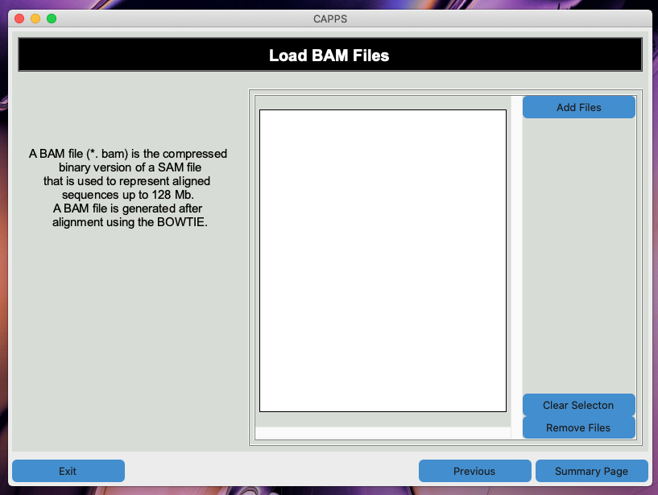

Click the **_Add Files_** button to add `.bam` files to CAPPS for filtering. You can add as many `.bam` files as necessary. 
    - **NOTE**: CAPPS will not let you proceed if no `.bam` file is selected. 
    - **NOTE**: CAPPS will generate an error if the same `.bam` file is selected more than once. 
    
&nbsp;

Once the `.bam` files have been added, they will be displayed in the text box as follows:

&nbsp;

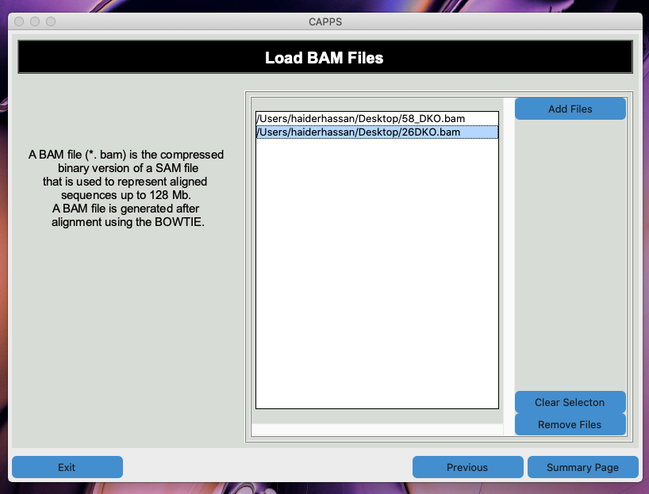


&nbsp;

Click the **_Summary Page_** button to go to the **Summary Page**. Click **_Print Summary_** to confirm the summary of experimental settings and `.bam` files that were selected. 

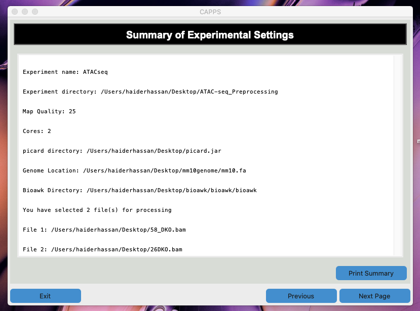

&nbsp;

Once you have confirmed the experimental settings, click **_Next Page_** in order to continue to the filtering page. 

&nbsp;

### **BAM File Filtering and Peak Calling Page:**

This page will print out a progress report as CAPPS filters the `.bam` file(s), calls peaks, converts `.bdg` file to `.bed` file, and generates the `.bw` from `.bdg` file. At the end, CAPPS will remove all unnecessary files. The called peaks will be saved in seperate folders within the experimental directory. 
   - **NOTE**: Once CAPPS has been initiated, the **_Start_** and **_Previous_** buttons will be disabled until CAPPS is finished performing all of the processes.

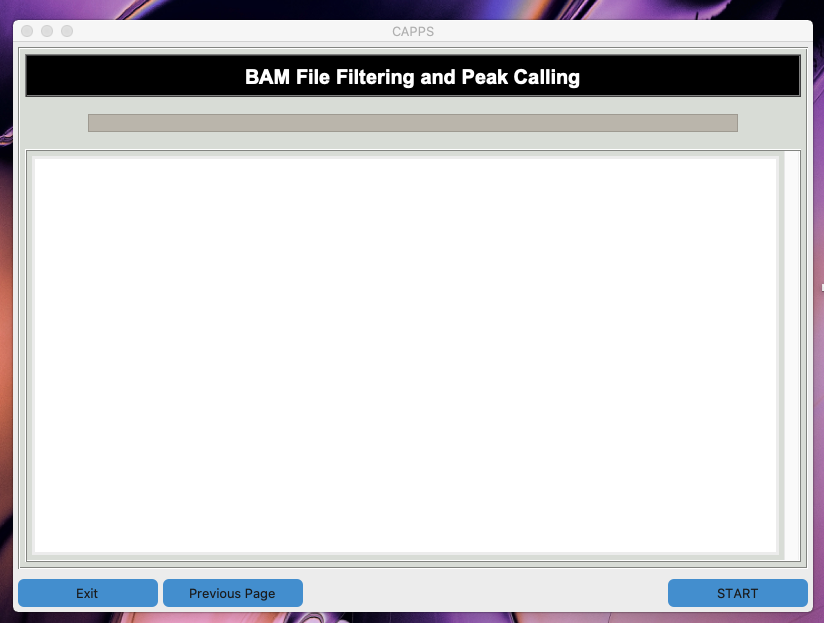

&nbsp;


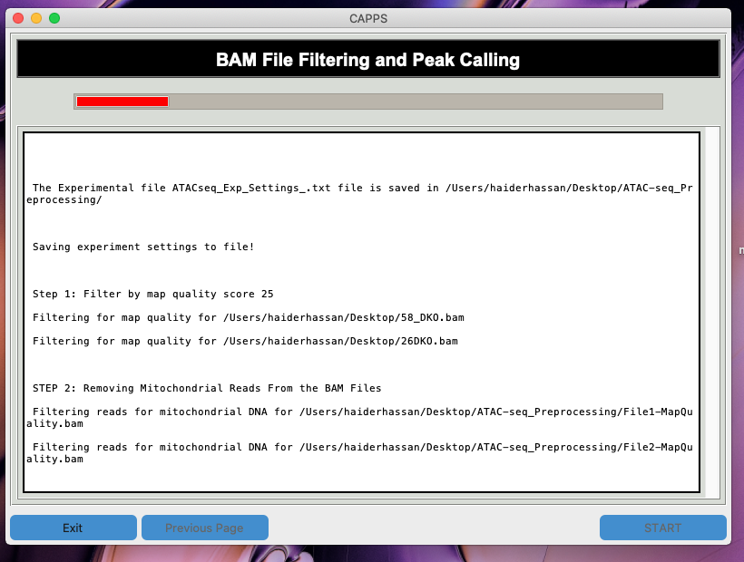

&nbsp;


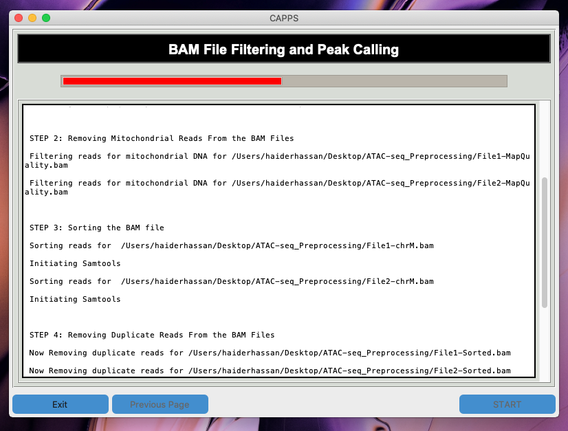

&nbsp;

 
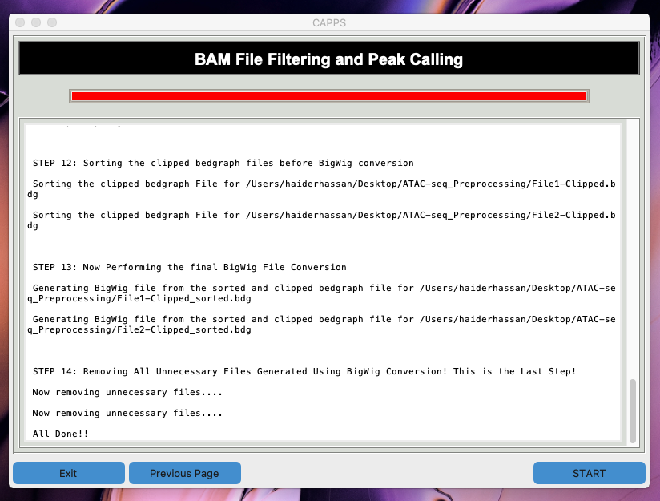

&nbsp;


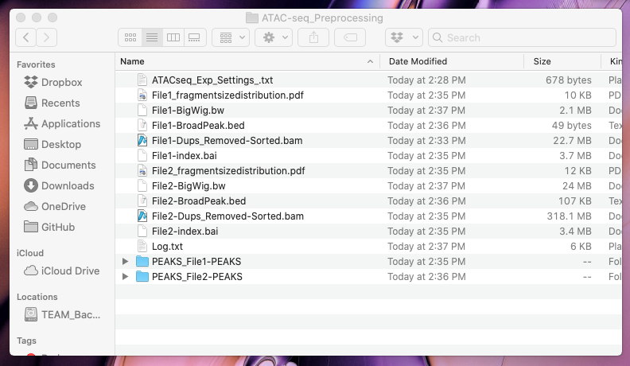

&nbsp;

&nbsp;


At the end, CAPPS will name the files by the number they were loaded. If you choose to reference the file number to your original name tags, please click on the **_Experiment Name Assigned_****_Exp_Settings.txt** file, and it will trace the file numbers to your original naming scheme. 


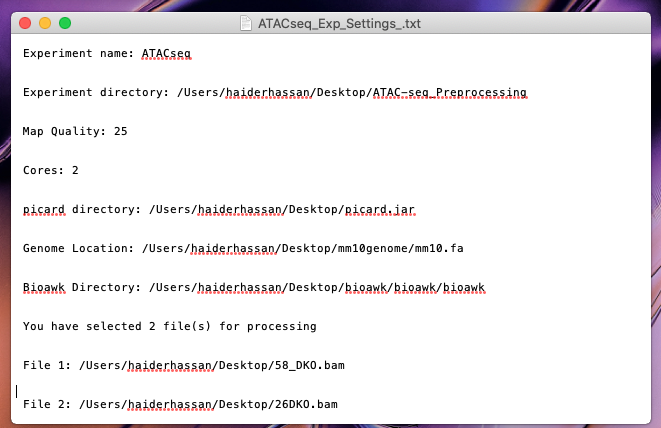

